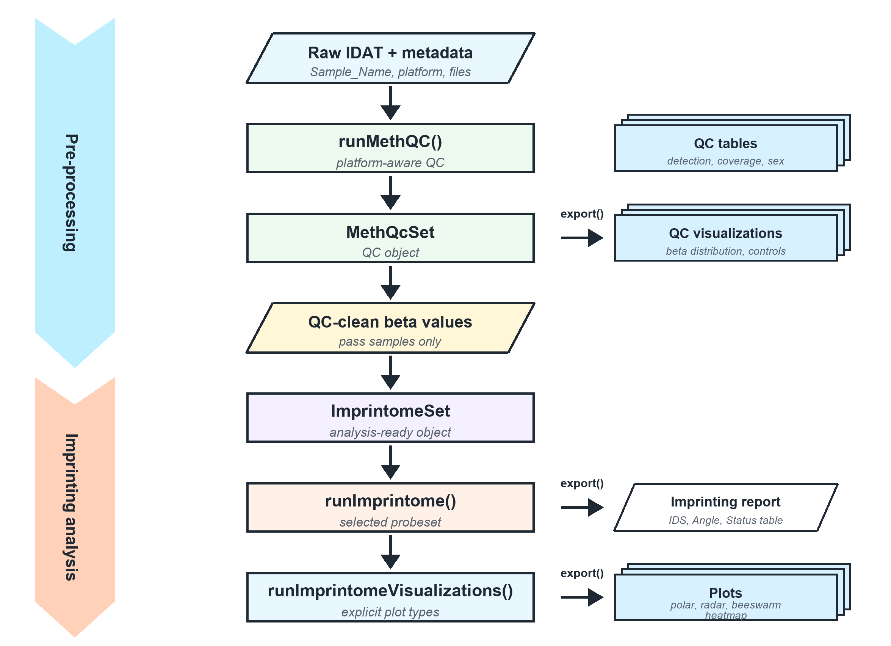

<h1>imprintomeR</h1>

imprintomeR delivers comprehensive analysis and visualization of genomic imprinting from methylation array data. It enforces a robust S4 preprocessing-first workflow that integrates technical quality control (QC), computation of Imprinting Deviation Scores (IDS), and publication-quality visualizations. The package provides two formal S4 containers:

- **MethQcSet**: Single-platform QC and preprocessing
- **ImprintomeSet**: Analysis-ready container for imprinting studies

## Installation

Install the latest development version:

```r
# Using devtools
devtools::install_github("hongjianjin/imprintomeR")

# Or from local source
devtools::install("path/to/imprintomeR")
```

After installation, download required data files:

```r
library(imprintomeR)
setup_imprintome_data()  # Downloads annotation files on first use
```

This downloads two annotation files (total ~52 MB):
- CpG probe coordinates and annotations
- ICR (Imprinted Gene Region) probeset definitions

For more details on data file management, see `data-raw/README.md`.

## Table of Contents

- [Installation](#installation)
- [Architecture: Preprocessing-First Workflow](#architecture-preprocessing-first-workflow)
- [Core Formulas](#core-formulas)
- [Recommended Workflow](#recommended-workflow)
  - [Step 1: QC Preprocessing (MethQcSet)](#step-1-qc-preprocessing-methqcset--optional-if-data-already-cleaned)
  - [Step 2: Create Analysis Container (ImprintomeSet)](#step-2-create-analysis-container-imprintomeset)
  - [Step 3: Run Imprinting Analysis](#step-3-run-imprinting-analysis)
  - [Step 4: Summarize, Visualize, Export](#step-4-7-summarize-visualize-export)
- [Detailed Examples](#detailed-examples)
  - [MethQcSet: Platform-Specific Preprocessing](#methqcset-platform-specific-preprocessing)
  - [ImprintomeSet: Analysis Container](#imprintomeset-analysis-container)
  - [Run Imprinting Analysis](#run-imprinting-analysis)
  - [Summarize & Inspect](#summarize--inspect)
- [Visualization](#visualization)
  - [Available Plot Types](#available-plot-types)
  - [Example Plots](#example-plots)
- [Export Results](#export-results)
- [Testing](#testing)
- [Vignettes](#vignettes)
- [AI Agent Skill](#ai-agent-skill)

## Architecture: Preprocessing-First Workflow

Raw methylation arrays often come from mixed platforms (450K, EPICv1, EPICv2). The **MethQcSet** container isolates QC processing for a single platform, preventing silent data corruption from cross-platform merging.

<p align="center">
  
</p>

```
Metadata + IDAT Files (mixed platforms)
    ↓
[check_platform(meta)] → detect array platform per sample
    ↓
Subset meta by platform
    ↓
[runMethQC(meta_platform)] → load IDAT → extract beta + p-values → QC metrics → MethQcSet
    ↓
Per-platform QC-clean MethQcSet
    ↓
[as.ImprintomeSet()]
    ↓
[runImprintome()] → Analysis results (IDS, Angle, etc.)
    ↓
Visualize & Export
```

## Core Formulas
- Imprint Deviation Index(**IDI**): (beta - 0.5) × 2
- Imprint Deviation Score(**IDS**): √((paternal_median - 0.5)² + (maternal_median - 0.5)²)
- **Deviation Angle**: atan2(maternal_median - 0.5, paternal_median - 0.5) \

The core formulas quantify imprinting deviations using multiple complementary metrics. The Imprint Deviation Score (IDS) computes the Euclidean distance from the balanced methylation state (0.5, 0.5) based on paternal and maternal median methylation values, capturing overall deviation magnitude. The Angle represents the direction of deviation in polar coordinates, indicating the relative contribution of paternal versus maternal methylation changes. The Imprint Deviation Index (IDI), calculated as ((\beta - 0.5) \times 2), quantifies per-probe deviation scaled between (-1) and (1), reflecting the magnitude and direction of methylation shift from the balanced state. Together, IDS, Angle, and IDI provide a comprehensive numeric framework for analyzing allele-specific methylation patterns.


### Angle Direction Mapping
The Angle Direction Mapping associates segments of the polar coordinate circle with specific biologically relevant methylation patterns. Each 45-degree sector corresponds to distinct imprinting mechanisms, such as paternal gain or maternal loss of methylation, or global hypo- or hypermethylation. This mapping facilitates intuitive interpretation of the polar plot by linking angular positions to parental allele-specific methylation changes.

| Angle (°) | Mechanism Label                  |
|-----------|--------------------------------|
| 0°        | Pat-Gain                       |
| 45°       | Global-Hyper                   |
| 90°       | Mat-Gain                      |
| 135°      | Mat-Gain + Pat-Loss            |
| 180°      | Pat-Loss                      |
| 225°      | Global-Hypo                   |
| 270°      | Mat-Loss                      |
| 315°      | Pat-Gain + Mat-Loss            |


## Recommended workflow

### Step 1: QC Preprocessing (MethQcSet) — Optional if Data Already Cleaned

**If you have RAW data:**

`meta.tsv` must be a tab-delimited file with at least `Sample_Name` and `Sample_Group` columns.

**For QC workflow (Option A — raw IDAT files):** also include `Basename` column (full path prefix to IDAT files).

**For direct analysis (Option B — QC already done externally):** `Basename` is not needed; just `Sample_Name` and `Sample_Group` suffice.

Additional columns (e.g., sex, diagnosis) are carried through and available for plotting.

```
Sample_Name    Basename                                   Sample_Group    SEX
SampleA        /data/idats/202301234567_R01C01            Control         F
SampleB        /data/idats/202301234567_R02C01            Case            M
SampleC        /data/idats/202301234568_R01C01            Control         F
SampleD        /data/idats/202301234568_R02C01            Case            M
```

> `Basename` must be the full path prefix to the IDAT files, i.e. the path without `_Red.idat` / `_Grn.idat`.

```r
library(imprintomeR)

# Load metadata (requires Basename column with IDAT path prefixes)
meta <- LoadMeta("meta.tsv")

# Option A: platform unknown or mixed — detect first
meta <- check_platform(meta)   # reads IDAT probe counts; appends Platform column
table(meta$Platform)           # inspect; split if multiple platforms present

meta_epic <- meta[meta$Platform == "EPIC", ]
# meta_epic looks like:
#   Sample_Name    Basename                              Sample_Group    SEX    Platform
#   SampleA        /data/idats/202301234567_R01C01        Control         F      EPIC
#   SampleC        /data/idats/202301234568_R01C01        Control         F      EPIC
qcset <- runMethQC(meta_epic)  # platform auto-resolved from meta$Platform

# Density-report PDFs for all/PASS/FAIL samples are written by default
# qcset <- runMethQC(meta_epic, outdir = "qc_output", prefix = "epic")
# Use save_qc_report = FALSE to suppress them.

# Option B: platform already known
# qcset <- runMethQC(meta, platform = "EPIC")

# Inspect QC results
qc_summary <- qc_summarize(qcset)
str(qc_summary)
# $qc_status : table of Final.QC PASS/FAIL counts
# $qc_tables : names of populated qc_tables keys

# Access QC_matrix directly
qc_matrix <- qc_tables(qcset)[["QC_matrix"]]
table(qc_matrix$Final.QC)

# Visualize QC metrics (all plot() calls return a ggplot2 object)
p_bar  <- plot(qcset, type = "qc_bar",          outFile = "qc_bar.pdf")          # PASS/FAIL bar chart (default)
p_int  <- plot(qcset, type = "intensity",        icutoff = 11,
               outFile = "qc_intensity.pdf")                                       # mMed vs uMed scatter
p_dp   <- plot(qcset, type = "detection_pval",   pcutoff = 0.05,
               outFile = "qc_aveDetPval.pdf")                                    # avg detection p-val per sample
p_cov  <- plot(qcset, type = "probe_coverage",   outFile = "qc_probe_coverage.pdf") # % probes detected per sample
p_sex  <- plot(qcset, type = "predicted_sex",    outFile = "qc_predicted_sex.pdf")  # predicted sex distribution
p_ctrl <- plot(qcset, type = "ctrl_metrics",         outFile = "qc_ctrl_matrix_summary.pdf")   # ewastools scores (if available)
plot(qcset, type = "ctrl_metrics_detail",            outFile = "qc_ctrl_matrix_detail")         # per-metric PDFs (Bisulfite/Specificity)

# Export cleaned data
# xlsx: single workbook — meta (+ Platform, Final.QC), QC_matrix,
#   recall_rate, cutoffs, ctrl_metrics, contamination, predUniqDonor_ID
export(qcset, outdir = "qc_output", format = c("xlsx", "rds"))
```

> **Already have QC-cleaned data?** Skip to [Step 2 Option B](#step-2-create-analysis-container-imprintomeset) and construct `ImprintomeSet` directly from `beta` + `meta`.

Key MethQcSet features:

- **Platform validation**: Prevents mixing 450K, EPICv1, EPICv2
- **QC metrics**: Detection p-values, intensity summaries (mMed/uMed/aveMed merged into `QC_matrix`), probe coverage
- **Minfi density reports**: `runMethQC(..., outdir = "qc_output", prefix = "epic")` writes `{prefix}_QC_densityPlot_all/pass/fail.pdf` by default; use `save_qc_report = FALSE` to suppress them
- **Canonical `qc_tables` keys** (populated by `runMethQC()`):
  - `QC_matrix` — per-sample detection stats, intensity, predictedSex, `Final.QC`
  - `recall_rate` — per-probe % detected across all / PASS / FAIL samples
  - `cutoffs` — QC threshold criteria with Pass/Fail expressions (detection/probe-coverage required; intensity reported only; control metrics when available)
    - **Core metrics (3 rows):** log2MedianIntensity (reported only), aveDetectionPval (<0.05), pctDetectedCpG_dP0.05 (>95)
    - **SNP metrics (1 row):** snps_outliers_aveLogOdds (>-4)
    - **Control metrics (18 rows, if ewastools available):** Restoration, Staining, Extension, Hybridization, Target_Removal, Bisulfite_Conversion, Specificity, Non-polymorphic
    - **Columns:** criteria, cutoff, Pass, Fail, Final.QC, CtrlMetrics.QC
    - **Conditional formatting:** Use `SaveTableStyle()` (from `openxlsx`) with `condFmt` parameter to highlight Pass/Fail expressions in Excel exports
  - `ctrl_metrics` — control probe metrics (if ewastools available)
  - `contamination` — SNP agreement / sample-swap check (if ewastools available)
  - `predUniqDonor_ID` — predicted unique donors per sample group (if ewastools available)
- **EPICv2 aggregation required**: Replicate probes (e.g. `cg..._TC11`, `cg..._TC12`) must be collapsed to base probe IDs before conversion — `aggregate_probes()` is a required step for EPICv2 (`as.ImprintomeSet()` will error if skipped)
- **Merge operations**: Synchronized metadata/beta alignment (`merge()`)
- **Export workflow**: Write QC tables, beta values, metadata to disk (`export()`)

### Step 2: Create Analysis Container (ImprintomeSet)

Once QC-approved, convert to analysis-ready object:

```r
# Option A: convert from a MethQcSet (recommended — carries platform/assay automatically)

# EPICv2 only: aggregate replicate probes first (required)
# as.ImprintomeSet() will error if this step is skipped for EPICv2.
if (qcset@platform == "EPICv2") {
  qcset <- aggregate_probes(qcset)  # ~937k → ~865k unique base probes
}

x <- as.ImprintomeSet(
  qcset,
  probeset = probesets[["selected"]],
  genome = "hg19"
)

# Option B: build directly from beta + meta (QC already done externally)
# Note: Basename column is not needed since QC step is skipped
probesets <- readRDS(system.file("extdata", "probesets_hg19.rds", package = "imprintomeR"))
meta <- LoadMeta("meta.tsv")  # Only needs Sample_Name and Sample_Group
beta <- LoadBeta("cleaned_beta.tsv")   # probes × samples matrix, already QC-filtered

x <- ImprintomeSet(
  beta    = beta,
  meta    = meta,
  probeset = probesets[["selected"]],
  genome  = "hg19",
  assay   = "EPIC"                     # "450K" | "EPIC" | "EPICv2"
)

# Either way, x is ready for analysis
# x now contains: beta, meta, probeset, genome, assay
```

### Step 3: Run Imprinting Analysis

```r
x <- runImprintome(
  x,
  probeset = "selected",
  ids_cutoff = 0.2
)

# Results stored in results(x)
names(results(x))
```

### Step 4-7: Summarize, Visualize, Export

```r
s <- summarize(x)

p <- plot(x, plot_type = "polar", result_name = "AnalyzeImprintStatus.selected",
          colorColumn = "Sample_Group", outFile = "polar.pdf")

manifest <- export(x, outdir = "imprintome_export", prefix = "imprintome", save_plots = TRUE)
```

## Detailed Examples

### MethQcSet: Platform-Specific Preprocessing

```r
library(imprintomeR)

# Load metadata with Basename column (IDAT path prefixes)
meta <- LoadMeta("meta.tsv")

# Platform unknown: detect from IDAT files first
meta <- check_platform(meta)
table(meta$Platform)

# Run QC for one platform at a time
meta_epic <- meta[meta$Platform == "EPIC", ]
qcset_epic <- runMethQC(meta_epic)           # platform auto-resolved

meta_450k <- meta[meta$Platform == "450K", ]
qcset_450k <- runMethQC(meta_450k)

# Platform known: pass directly
# qcset <- runMethQC(meta, platform = "EPIC")

# Export QC results
exported_files <- export(
  qcset_epic,
  outdir = "qc_results",
  format = c("xlsx", "rds")
)
# Creates three files:
# 1. qc_table_main.xlsx — Primary QC results (metadata, QC_matrix, Ctrl_matrix, statistics)
# 2. qc_table_extra.xlsx — Supplementary technical data (QC_metrics, contamination, recall_rate, predUniqDonor_ID)
# 3. qcset_epic.rds — Complete MethQcSet object for programmatic access
```

**File 1: qc_table_main.xlsx** (Primary QC Results)

<table style="width:100%; border-collapse:collapse;">
<thead>
<tr>
  <th style="width:20%; text-align:left; border-bottom:2px solid #ccc;">Sheet</th>
  <th style="width:60%; text-align:left; border-bottom:2px solid #ccc;">Content</th>
  <th style="width:20%; text-align:left; border-bottom:2px solid #ccc;">Always Present?</th>
</tr>
</thead>
<tbody>
<tr><td><code>metadata</code></td><td>Sample metadata + Platform + Final.QC columns</td><td>Yes</td></tr>
<tr><td><code>QC_matrix</code></td><td>Per-sample detection stats, intensity (mMed/uMed/aveMed), predictedSex, Final.QC</td><td>Yes</td></tr>
<tr><td><code>Ctrl_matrix</code></td><td>Control probe metrics + CtrlMetrics.QC</td><td>If ewastools available</td></tr>
<tr><td><code>statistics</code></td><td>Per-Sample_Group summary: GROUP, Total, PASS, FAIL, PASS.RATIO, FAIL.RATIO</td><td>If Sample_Group in metadata</td></tr>
</tbody>
</table>

&nbsp;

**File 2: qc_table_extra.xlsx** (Supplementary/Technical Results)

<table style="width:100%; border-collapse:collapse;">
<thead>
<tr>
  <th style="width:20%; text-align:left; border-bottom:2px solid #ccc;">Sheet</th>
  <th style="width:60%; text-align:left; border-bottom:2px solid #ccc;">Content</th>
  <th style="width:20%; text-align:left; border-bottom:2px solid #ccc;">Always Present?</th>
</tr>
</thead>
<tbody>
<tr><td><code>QC_metrics</code></td><td>QC threshold criteria (criteria, cutoff, Final.QC) — filtered cutoffs table</td><td>Yes</td></tr>
<tr><td><code>contamination</code></td><td>SNP agreement matrix for sample swap detection</td><td>If ewastools available</td></tr>
<tr><td><code>recall_rate</code></td><td>Per-probe % detected across all / PASS / FAIL samples</td><td>Yes</td></tr>
<tr><td><code>predUniqDonor_ID</code></td><td>Predicted unique donor IDs per sample group</td><td>If ewastools available</td></tr>
</tbody>
</table>

&nbsp;

Beta values are excluded from xlsx (too large) and saved as `.rds` only.

```r
# Inspect MethQcSet structure (now includes @statistics slot)
str(qcset_epic)
# Formal class 'MethQcSet' [package "imprintomeR"] with 8 slots
#   @ beta              : num [1:866895, 1:4] 0.152 0.892 0.654 0.723 ...
#   @ meta              :'data.frame': 4 obs. of 4 variables:
#   @ detection_pval    : num [1:866895, 1:4] 0.001 0.001 0.001 0.001 ...
#   @ qc_tables         :List of 5
#     $ QC_matrix      : 'data.frame': 4 obs. of 13 variables (detection stats, intensity, predictedSex, Final.QC)
#     $ recall_rate    : 'data.frame': 866895 obs. of 4 variables (per-probe % detected)
#     $ cutoffs        : 'data.frame': 5 obs. of 2 variables (QC threshold criteria)
#     $ ctrl_metrics   : 'data.frame' (if ewastools available)
#     $ contamination  : 'data.frame' (if ewastools available)
#   @ statistics        : 'data.frame' or NULL — Per-Sample_Group QC summary (populated on export)
#     $ GROUP          : character (Sample_Group or "All")
#     $ Total          : integer (number of samples)
#     $ PASS           : integer (number passing)
#     $ FAIL           : integer (number failing)
#     $ PASS.RATIO     : numeric
#     $ FAIL.RATIO     : numeric
#   @ platform          : chr "EPIC"
#   @ aggregation_status: chr "none"
#   @ qc_params         : list()

# Inspect QC_matrix: includes intensity, predictedSex, Final.QC
qc_matrix <- qc_tables(qcset_epic)[["QC_matrix"]]
head(qc_matrix[, c("Sample_Name", "mMed.Intensity", "aveMed.Intensity",
                    "pctDetectedCpG_dP0.05", "predictedSex", "Final.QC")])

# Access computed statistics (after export or manual computation)
stats_tbl <- statistics(qcset_epic)
# Returns data.frame: GROUP, Total, PASS, FAIL, PASS.RATIO, FAIL.RATIO

# Per-probe recall
recall <- qc_tables(qcset_epic)[["recall_rate"]]
head(recall[order(recall$pct_detected_all), ])

# QC cutoffs (filtered version exported as QC_metrics sheet)
cutoffs_all <- qc_tables(qcset_epic)[["cutoffs"]]
```

Merge multiple QC-clean single-platform datasets:

```r
# Two single-platform MethQcSet objects (from separate runMethQC() calls)
qcset1 <- runMethQC(meta1, platform = "EPIC")
qcset2 <- runMethQC(meta2, platform = "EPIC")

# Synchronized merge
merged <- merge(qcset1, qcset2, how = "inner")

# Find common elements
common_samples <- find_intersection(qcset1, qcset2, by = "samples")
common_probes <- find_intersection(qcset1, qcset2, by = "probes")
```

### ImprintomeSet: Analysis Container

Convert QC-clean data to analysis container:

```r
# Load probeset annotations
probesets <- readRDS(system.file("extdata", "probesets_hg19.rds", package = "imprintomeR"))

# Convert from MethQcSet
x <- as.ImprintomeSet(
  qcset,
  probeset = probesets[["selected"]],
  genome = "hg19"
)

# Or construct directly
x <- ImprintomeSet(
  beta = beta,
  meta = meta,
  probeset = probesets[["selected"]],
  genome = "hg19",
  assay = "EPICv1"
)
```

### Run Imprinting Analysis

```r
x <- runImprintome(
  x,
  probeset = "selected",
  ids_cutoff = 0.2
)

res <- results(x)[["AnalyzeImprintStatus.selected"]]
head(res)
```

### Summarize & Inspect

```r
# Inspect ImprintomeSet structure
str(x)
# Formal class 'ImprintomeSet' [package "imprintomeR"] with 7 slots
#   @ beta      : num [1:865, 1:4] 0.152 0.892 0.654 0.723 ...
#   @ meta      :'data.frame': 4 obs. of 4 variables (Sample_Name, Basename, Sample_Group, SEX)
#   @ probeset  :'data.frame': 120 obs. of 8 variables (probeset annotations: Name, UCSC_RefGene_Name, Chromosome, etc.)
#   @ genome    : chr "hg19"
#   @ assay     : chr "EPIC"
#   @ results   :List of 1
#     $ AnalyzeImprintStatus.selected: 'data.frame': 120 obs. of 8 variables (IDS, Angle, IDI, etc.)
#   @ plots     :List of 0 (empty until populated by plot() calls)

# Summarize results
s <- summarize(x)
s$object
s$results
s$plots
```

## Visualization

### Available plot types

- `auto` - smart dispatch
- `polar` - IDS vs Angle scatter with colored samples
- `mirror_density` - maternal/paternal methylation density distributions
- `beeswarm` - cohort probe methylation by sample
- `beeswarm_origin` - origin-split beeswarm (maternal/paternal probes)
- `beeswarm_chr` - chromosome-faceted beeswarm (single sample)
- `violin` - methylation distribution by sample (violin plots)
- `heatmap_by_probe` - Heatmap_by_probe (probes × samples with Illumina probe IDs)
- `heatmap_by_gene` - gene-level aggregated heatmap (genes aggregated by Closest_TSS_gene_name)
- `circular_heatmap` - circular heatmap with grouped sections (probes × samples arranged in circle by sample groups)
- `cor_heatmap` - sample-to-sample correlation heatmap
- `rainfall` - chromosomal rainfall plot (single sample)
- `radar` - radar/star plot of imprinting metrics (single sample)

### Standard workflow plots

`plot_types = "default"` runs the standard workflow set: `polar`, `beeswarm_origin`, `mirror_density`, `heatmap_by_probe`, `heatmap_by_gene`, `radar`, `beeswarm_chr`, and `rainfall`. `circular_heatmap` is available when requested explicitly, or with `plot_types = "all"`.

```r
sample_id1 <- colnames(beta(x))[2]

x <- runImprintomeVisualizations(
  x,
  plot_types = "default",
  probeset = "selected",
  sample_id = sample_id1,
  prefix = "imprintome",
  store_plots = TRUE,
  save_plots = FALSE
)

attr(x, "visualization_manifest")
names(plots(x))
```

Use `save_plots = TRUE` with `outdir = "plots"` to write plot files during generation while storing successful plot objects.

### Example plots

```r
# 1) Auto dispatch (default polar plot from results)
p_auto <- plot(
  x,
  plot_type = "auto",
  result_name = "AnalyzeImprintStatus.selected",
  outFile = "plot_auto.pdf"
)

# 2) Polar plot (IDS vs Angle scatter)
p_polar <- plot(
  x,
  plot_type = "polar",
  result_name = "AnalyzeImprintStatus.selected",
  colorColumn = "Sample_Group",
  outFile = "plot_polar.pdf"
)

# 3) Mirror density (maternal/paternal distributions)
p_mirror <- plot(
  x,
  plot_type = "mirror_density",
  probeset = "selected",
  outFile = "plot_mirror_density.pdf"
)

# 4) Beeswarm (cohort probe methylation)
p_beeswarm <- plot(
  x,
  plot_type = "beeswarm",
  probeset = "selected",
  outFile = "plot_beeswarm.pdf"
)

# 5) Beeswarm by origin (maternal/paternal probes)
p_bee_origin <- plot(
  x,
  plot_type = "beeswarm_origin",
  probeset = "selected",
  outFile = "plot_beeswarm_origin.pdf"
)

# 6) Beeswarm by chromosome (single sample)
sample_id1 <- colnames(beta(x))[1]
p_bee_chr <- plot(
  x,
  plot_type = "beeswarm_chr",
  probeset = "selected",
  sample_id = sample_id1,
  chr = "chr11",
  outFile = paste0("plot_beeswarm_chr_", sample_id1, ".pdf")
)

# 7) Violin plot (methylation distributions by sample)
p_violin <- plot(
  x,
  plot_type = "violin",
  probeset = "selected",
  outFile = "plot_violin.pdf"
)

# 8) Heatmap_by_probe (probes × samples)
p_heatmap <- plot(
  x,
  plot_type = "heatmap_by_probe",
  probeset = "selected",
  outFile = "plot_heatmap.pdf"
)

# 9) Heatmap_by_gene (genes × samples, aggregated by median)
p_heatmap_gene <- plot(
  x,
  plot_type = "heatmap_by_gene",
  probeset = "selected",
  annoColumn = "Sample_Group",
  outFile = "plot_heatmap_by_gene.pdf"
)

# 10) Circular heatmap (grouped by sample group)
p_circle <- plot(
  x,
  plot_type = "circular_heatmap",
  probeset = "selected",
  sectionColumn = "Sample_Group",
  outFile = "plot_circular_heatmap.pdf"
)

# 11) Correlation heatmap (sample-to-sample)
cor_mat <- plot(
  x,
  plot_type = "cor_heatmap",
  probeset = "selected",
  SAMPLEID = "Sample_Name",
  prefix = "plot"
)

# 12) Rainfall plot (chromosomal distribution, single sample)
p_rainfall <- plot(
  x,
  plot_type = "rainfall",
  sample_id = sample_id1,
  probeset = "selected",
  outFile = paste0("plot_rainfall_", sample_id1, ".pdf")
)

# 13) Radar plot (imprinting metrics, single sample)
p_radar <- plot(
  x,
  plot_type = "radar",
  result_name = "AnalyzeImprintStatus.selected",
  sample_id = sample_id1,
  outFile = paste0("plot_radar_", sample_id1, ".pdf")
)
```

## Export QC Results

The `export()` method writes QC preprocessing results to **two organized Excel workbooks** for better separation of primary and supplementary data:

```r
export(
  qcset,
  outdir = "qc_output",
  format = c("xlsx", "rds", "txt")  # xlsx (default) | rds | txt | any combination
)
```

**Output files:**

**{prefix}_qc_table_main.xlsx** (primary QC results for review):
- `metadata` — Sample information with Platform and Final.QC columns
- `QC_matrix` — Per-sample QC metrics (intensity, detection p-values, probe coverage, predicted sex)
- `Ctrl_matrix` — Control probe metrics (if ewastools available)
- `statistics` — Per-Sample_Group summary table (Total, PASS, FAIL, pass/fail ratios)

**{prefix}_qc_table_extra.xlsx** (supplementary technical results):
- `QC_metrics` — QC decision thresholds (criteria, cutoff values, Final.QC status)
- `contamination` — SNP agreement matrix for sample swap detection (if available)
- `recall_rate` — Per-probe detection statistics across cohort (if available)
- `predUniqDonor_ID` — Predicted unique donors per sample group (if available)

**Additional output:**
- `{prefix}_qcset.rds` — Full MethQcSet object (if format includes "rds")
- `{prefix}_beta.txt` — Beta values, tab-delimited (if format includes "txt")
- `{prefix}_meta.txt` — Metadata, tab-delimited (if format includes "txt")
- `{prefix}_qc_matrix.txt` — QC metrics table, tab-delimited (primary txt file)
- `{prefix}_qc_statistics.txt` — Statistics summary, tab-delimited (primary txt file)
- `{prefix}_qc_*.txt` — Individual QC tables, tab-delimited (supplementary files)
- `{prefix}_summary.txt` — Summary report with optional Notes section

**Statistics Sheet (automatic computation on export):**

The statistics sheet computes per-Sample_Group summaries from the QC_matrix:
- Groups samples by `Sample_Group` column in metadata
- Counts PASS/FAIL outcomes
- Calculates pass/fail ratios
- Automatically stored in `qcset@statistics` slot for later retrieval

**Notes Section in summary.txt:**

The `summary.txt` file always includes a "Notes" section that documents any optional sheets that were mentioned in the export format documentation but were NOT actually created (due to missing underlying data). For example:

```
Notes
=====

The following sheets were not included in the exported workbook(s):
- Ctrl_matrix
- contamination
- predUniqDonor_ID
```

If all documented optional sheets exist in the data, the Notes section will instead state:

```
Notes
=====

All documented sheets were successfully created.
```

This provides transparency about what data was available during export.

```r
manifest <- export(
  x,
  outdir = "imprintome_results",
  prefix = "imprintome",
  save_plots = TRUE,
  plot_device = "pdf"
)
```

## Test Suite

imprintomeR includes comprehensive unit tests (102+ passing tests). For development and contribution instructions, see `.github/copilot-instructions.md`.

### Running Tests Locally (Development)

If you're contributing to the package, run the test suite:

```r
devtools::test("path/to/imprintomeR")
```

To test your own analysis workflows:

```r
library(imprintomeR)

# Phase 1: QC Preprocessing
meta <- LoadMeta("your_meta.tsv")
meta <- check_platform(meta)
qcset <- runMethQC(meta[meta$Platform == "EPIC", ])

# Optional: EPICv2 aggregation
if (qcset@platform == "EPICv2") {
  qcset <- aggregate_probes(qcset)
}

export(qcset, outdir = "your_qc_output", format = c("xlsx", "rds"))

# Phase 2: Analysis
qcset <- readRDS("your_qc_output/*_qcset.rds")
x <- as.ImprintomeSet(qcset, probeset = probesets[["selected"]])
x <- runImprintome(x, probeset = "selected", ids_cutoff = 0.2)

# Visualize and export
plot(x, plot_type = "polar", outFile = "polar.pdf")
export(x, outdir = "your_analysis_output", prefix = "your_analysis", save_plots = TRUE)
```


## Vignettes

Detailed workflows and visualization tutorials are available in the package vignettes in R after installation using:

- `vignette("imprintomeset-quickstart")` - Quick start
- `vignette("imprintomeset-results-export")` - Visualization and export
- `vignette("imprintomeR-workflow-basic")` - End-to-end workflow using core functions without relying on S4 objects
- [imprintomeR_cli_README.md](vignettes/imprintomeR_cli_README.md) - Command-line QC and imprintome analysis workflows
- [GSE52567.ipynb](vignettes/GSE52567.ipynb) - GitHub-renderable notebook for a public GEO workflow
- [GSE240091.ipynb](vignettes/GSE240091.ipynb) - GitHub-renderable notebook for QC and imprintomeR workflow on a public GEO cohort

## AI Agent Skill

This repository includes an optional Codex-style AI agent skill for working with imprintomeR package workflows:

- [skills/imprintomer/SKILL.md](skills/imprintomer/SKILL.md)
- [skills/imprintomer/README.md](skills/imprintomer/README.md)

To install it locally:

```bash
mkdir -p ~/.codex/skills
cp -r skills/imprintomer ~/.codex/skills/
```

Then ask an AI agent:

```text
Use $imprintomer to create an imprintomeR workflow from IDAT files.
```

